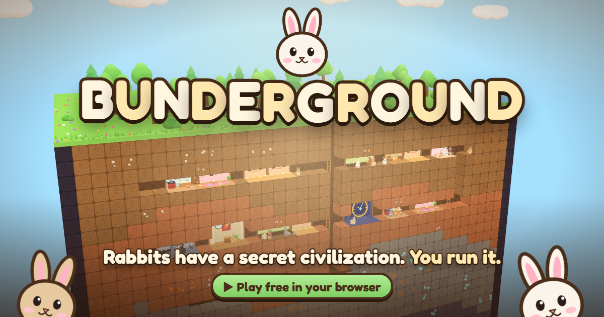

# 🐰 Bunderground
n

A cozy 3D colony-management game about a rabbit warren with a surprisingly complex society. Built with Three.js + Vite. Everything runs in the browser. Saves go to `localStorage` on the player's device, so there's no backend or database.

## Play locally

```bash
npm install
npm run dev      # http://localhost:5173
```

## Deploy to Vercel

1. Push this folder to a Git repo and import it in Vercel, or run `npx vercel` from this folder.
2. Vercel detects Vite. `vercel.json` sets the build command (`npm run build`) and the output directory (`dist`).

`npm run build && npm run preview` gives you a local preview of the production build.

## The game

- **Dig** tunnels through topsoil, red clay, stone and deep rock. Digging yields 🧱 clay, 🪨 stone, 🟠 copper and 💎 moon crystals.
- **Build** rooms in the dug-out space:
  - Cozy Burrow
  - Carrot Farm
  - Kitchen
  - Pantry
  - Social Lounge
  - Nursery
  - Gear Factory
  - Council Hall
  - the Moonstone Clock wonder, which is the win condition
- **Rabbits live their own lives.** Each rabbit has:
  - needs: hunger, energy, social
  - a mood
  - two personality traits
  - skills that improve with work
  - a clan, friendships, rivalries, a partner and family
- **Society:**
  - Couples form in the lounge.
  - Kits are born in nurseries.
  - Travelers join when there are free beds.
  - Unhappy rabbits leave.
  - The Council Hall holds elections every 7 days. The winning Chief's personality gives the whole colony a bonus.
  - Policies set work hours and rations.
- **Random events:** merchants, lost kits, festivals, squabbles, storms, weddings and foxes.
- **13 goals** guide you from a single burrow to the Moonstone Clock.

### Controls

| Action | Mouse / touch | Keys |
| --- | --- | --- |
| Pan | drag / one finger / right-drag | WASD, arrows |
| Zoom | wheel / pinch | `+` `-` |
| Pause / speed | top bar | `Space`, `1` `2` `3` |
| Dig / cancel dig / build | bottom toolbar | `X` / `C` / `B` |
| Colony overview | 🐰 button | `Tab` |
| Back / menu | | `Esc` |

## Trailer

`trailer/` holds a separate [Remotion](https://www.remotion.dev) project that renders the 78-second 1080p trailer. It is not part of the Vercel deploy (see `.vercelignore`).

The whole pipeline is code:

1. **Footage.** `scripts/capture.mjs` loads the real game in headless Chrome. It builds a showcase colony, stages each shot and drives the camera and the simulation frame by frame. Each shot is encoded to `public/clips/*.mp4`.
2. **Music & SFX.** `scripts/make-audio.mjs` synthesizes an original 100 BPM score and every sound effect, so there are no samples and no licenses. The effects include whooshes, impacts, pops, sparkles and a boop. Output goes to `public/audio/`.
3. **Edit.** `src/Trailer.tsx` holds the edit: cuts synced to the beat, kinetic type, the logo reveal, the end card and the sound design.

```bash
cd trailer
npm install
npm run audio                       # regenerate music + sfx
# serve the built game (npm run build in the root), then:
GAME_URL=http://127.0.0.1:5199/ npm run capture   # all shots, or: npm run capture -- farm lounge
npm run studio                      # preview/edit in Remotion Studio
npm run render                      # → out/bunderground-trailer.mp4
```

To show the game's URL on the end card, pass it in: `npx remotion render src/index.ts Trailer out/bunderground-trailer.mp4 --props='{"url":"your-game.vercel.app"}'`.
